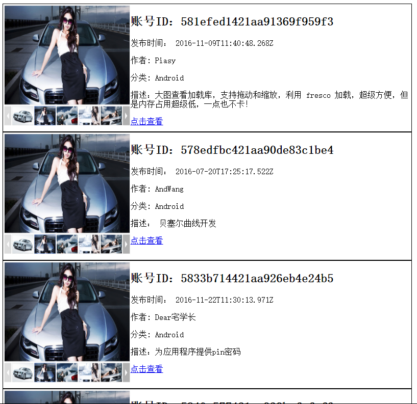

完成下面地址中的数据解析和绑定：
地址：http://gank.io/api/random/data/Android/20
要求：
    
+ 将获取的数据转换成字符串
```js
     var str = JSON.stringify(results);//将获取到的对象转换成字符串
     var str = JSON.parse(results);//将字符串转换成对象
```
+ 将数据保存到localstorage，并获取localstorage中的数据
```js
 //存到localStorage
    localStorage.setItem("results", str);
    localStorage.setItem("key", str);
    //从localStorage中取出数据
    var obj = localStorage.getItem("results");

    //clear() 删除全部的localStorage
//    localStorage.clear()
    //删除指定的localStorage
    localStorage.removeItem("key");


    obj = JSON.parse(obj);
    // '{"name":"dg","sex":"w","image":"i.jpg"}'

    var sd = JSON.parse(str);
    console.log(obj);
```
+ 将获取的数据解析成json对象
```js
     var str = JSON.stringify(results);//将获取到的对象转换成字符串
     var str = JSON.parse(results);//将字符串转换成对象
```
+ 将json对象中的数据绑定到html中（注意样式的美化）
```js
<body>

<ul id="list">
    
    <li>
        <a href="http://baidu.com">描述</a>
        <p>发布时间： <span></span></p>
        <p>作者: <span></span></p>
        <p>分类: <span></span></p>
    </li>
</ul>
<script src="js.js"></script>
<script>

    /**
     * 数据绑定
     * json ==> html中
     * @type {Element}
     */
    var list = document.getElementById("list");
   var d = data.results;
   var html = "";
    for(var i=0; i< d.length; i++){
        html += createList(d[i]);
    }
    list.innerHTML = html;
    function createList(data){
        var imgUrl = "";
        if(data["images"]){
            imgUrl = data["images"][0];
        }
        var html = ' <li>'+
                ''+
                '<h2>账号ID：<span>'+data["_id"]+'</span></h2>'+
                '<p>发布时间： <span>'+data["publishedAt"]+'</span></p>'+
                '<p>作者: <span>'+data["who"]+'</span></p>'+
                '<p>分类: <span>'+data["type"]+'</span></p>'+
                '<p>描述：<span>'+data["desc"]+'</span></p>'+
                '<a href="'+data["url"]+'">点击查看</a>'+
                '</li>';
        return html;
    }
</script>

</body>
```
