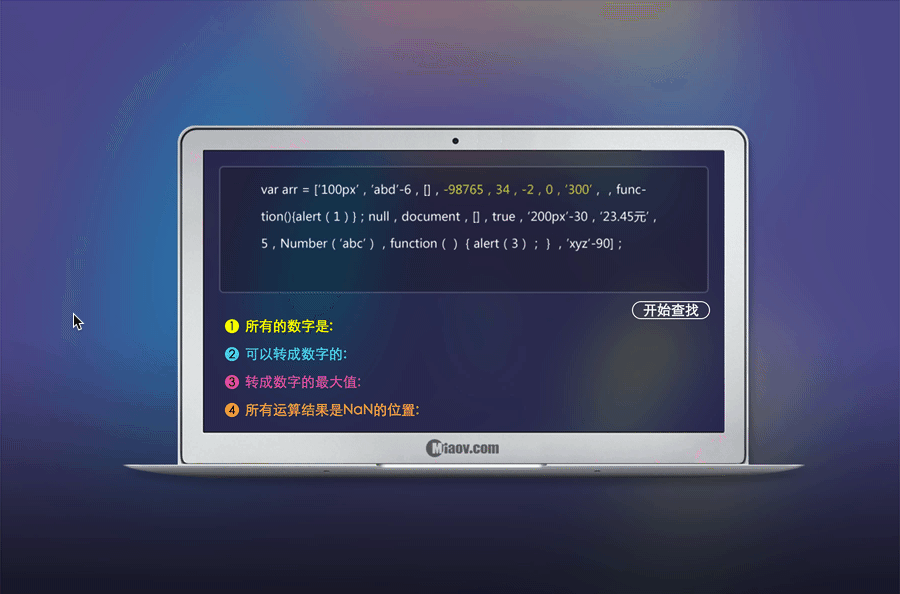

1. 给定一个数组`[4,6,7,8,9]`，求出数组中所有元素之和。
2. 数组`[4,5,6,4,5,7,8,9,7,6,5]`, 去掉数组中重复的元素。
3. 在一个大学的编程选修课班里，我们得到了一组参加该班级的学生数据，分别是姓名、性别、年龄和年级，接下来呢，我们要利用JavaScript的知识挑出其中所有是大一的女生的的名字哦。
```js

学生信息如下：

    ('小A','女',21,'大一'),  ('小B','男',23,'大三'),

    ('小C','男',24,'大四'),  ('小D','女',21,'大一'),

    ('小E','女',22,'大四'),  ('小F','男',21,'大一'),

    ('小G','女',22,'大二'),  ('小H','女',20,'大三'),

    ('小I','女',20,'大一'),  ('小J','男',20,'大三')
```

4. 有一个数组，按要求完成如图所示的效果：
```js
 //数组中的元素为：
  var arr = ["100px", "abc"-6, [], -9866, 34, -2, 0, '300', , function(){alert(0)},
        null, document, [], true, '200px'-30, "23.45元", 5, Number("abc"),
        function(){alert(3)}, 'xyz'-90];  
```
