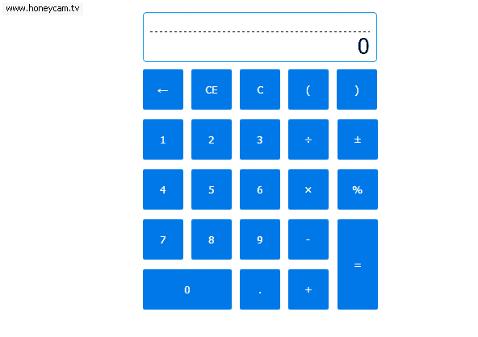

# 综合练习

完成如图中的计算机所有功能：

功能描述：

1. 完成如图中的计算机所有功能（`+`、`-`、`*`、 `/`、`%`）
2. 括号调整计算的优先级
3. `<--`的功能为：删除结果输出区域的最后一位

**Note**：

+ 清除输入(CE)：键入数字时，按下相应的数字键，如果按错可用（CE）键消去一次数值，再重新输入正确的数字
如你要输9*7，但你输入了9*8，显示屏显示8（输错了）时，按一下CE键，那么就只是清除了8（显示屏则显示"0"），然后你再按7，再按=（显示屏上就会显示63）
+ 清除键(C)：清除数据，所有数据、算式都清除，归零复位